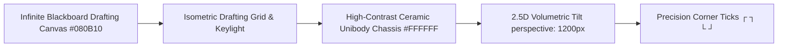
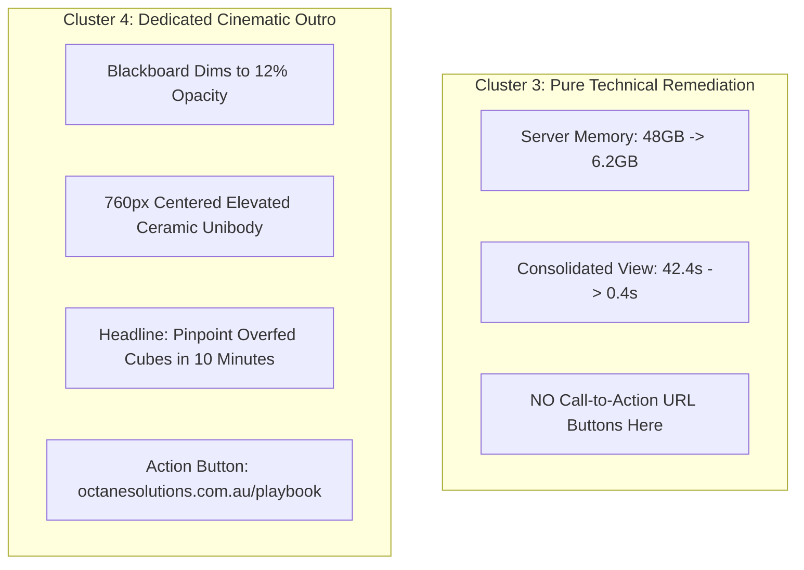

# 💎 Octane Editorial Motion Engineering Playbook
> **Master Reference for High-End B2B Kinetic Typography, 2.5D Spatial Canvases, Character Satire, and Expressive Acoustic Engineering**
> *Codified from live production reviews and architectural invariants.*

---

## 📑 Table of Contents
1. [Part I: Constitutional Anti-Slop & Asset Quality Invariants](#-part-i-constitutional-anti-slop--asset-quality-invariants)
2. [Part II: Spatial Blackboard Canvas & Volumetric Chassis Architecture](#-part-ii-spatial-blackboard-canvas--volumetric-chassis-architecture)
3. [Part III: Industry Satire & Editorial Visual Humor](#-part-iii-industry-satire--editorial-visual-humor)
4. [Part IV: Decoupled Diagnostic Displays & Standalone Cinematic Outro](#-part-iv-decoupled-diagnostic-displays--standalone-cinematic-outro)
5. [Part V: Elite Motion Designer Sequencing Suite](#-part-v-elite-motion-designer-sequencing-suite)
6. [Part VI: Expressive Human Voiceover & Acoustic Architecture](#-part-vi-expressive-human-voiceover--acoustic-architecture)
7. [Part VII: Codebase Architecture & Reference Primitives](#-part-vii-codebase-architecture--reference-primitives)

---

## 🎨 Part I: Constitutional Anti-Slop & Asset Quality Invariants

### 1. The Zero-Slop Constraint
- **Strictly Banned**: Low-effort generic icon packs, flat clipart cutouts, unstyled vector stick figures, and math-rendered geometric doodles.
- **The Core Rule**: Never compromise on visual quality with the mindset *"Oh I just created a character looking using math... I think it's good enough."* Every asset must look like it was hand-crafted by an award-winning motion design studio (Buck, Ordinary Folk, Apple Design).

### 2. Bespoke 3D Claymorphic Character Generation
- Characters, hardware elements, and situational illustrations must be rendered in **high-end 3D claymorphic editorial style**.
- **Seamless Blending Protocol**:
  - Assets intended for ceramic chassis cards MUST be generated with an **exact solid `#FFFFFF` background**.
  - In CSS/React, apply `mixBlendMode: 'multiply'` and `objectFit: 'cover'`.
  - This ensures that character artwork completely dissolves into the white chassis card with **zero bounding boxes, zero dark artifacts, and zero visible seams**.

```tsx
// Example: Seamless 3D Artwork Integration
<div style={{ background: '#FFFFFF', borderRadius: 14, overflow: 'hidden', position: 'relative', height: 195 }}>
  
</div>
```

---

## 📐 Part II: Spatial Blackboard Canvas & Volumetric Chassis Architecture



### 1. The Spatial Drafting Canvas
- **Never Box-In Animations**: Do not confine diagrams into a single small viewport box. Free the elements across an **infinite drafting blackboard canvas** (`SpatialBoard.tsx`).
- **Canvas Palette**:
  - Background: Deep Void Ceramic `#080B10`
  - Subtle Grid Lines: `rgba(255, 255, 255, 0.04)` spaced at 60px intervals
  - Keylighting: Radial specular glow `radial-gradient(circle at 50% 40%, rgba(255,255,255,0.06), transparent 70%)`

### 2. High-Contrast Ceramic Pop-Out Unibody Chassis
- **The Pop-Out Principle**: Foreground analytical cards must pop out aggressively against the dark blackboard. Always use a pure, tactile **Ceramic White Unibody Chassis** (`#FFFFFF` or `#FAFAFA`).
- **Volumetric Elevation & Lighting**:
  - Active Drop Shadow: `0 30px 70px -10px rgba(0, 0, 0, 0.55), 0 12px 30px -6px rgba(0, 0, 0, 0.35)`
  - Tactical Corner Registration Ticks: Monospace characters `┌ ┐ └ ┘` positioned in corners at opacity `0.18`.
  - Status Pill Badges: Top-right indicator badges with semantic signal palettes (Crimson `#E11D48`, Mint `#059669`, Amber `#D97706`).

### 3. Zero-Header Information Density Rule
- **Strictly Banned**: Superfluous top branding banners, watermark headers, or meta labels like *"Octane Telemetry Labs"*.
- **The Rationale**: Keep 100% of viewer attention locked on the data, the mechanical problem, and the quantitative solution.

---

## 🎭 Part III: Industry Satire & Editorial Visual Humor

### 1. Staging Relatable B2B Pain Points
- High-converting B2B narratives balance authoritative technical rigor with **tasteful, relatable satire**.
- Example: When addressing TM1 calculation lag, illustrate the classic corporate trope where IT recommends *"Just add more RAM!"* rather than diagnosing the algorithmic calculation tree.

### 2. Synchronized Speech Bubble Staging
- Speech bubbles must anchor directly above character heads with pointer tails.
- **Animation**: Use bouncy spring dynamics (`damping: 12, stiffness: 140`) triggered sequentially to match the narrator's vocal timing.
- **Zero Collision Invariant**: Stagger bubble coordinates and pointer tail anchors across left, center, and right character positions so text never overlaps.

---

## 🚀 Part IV: Decoupled Diagnostic Displays & Standalone Cinematic Outro



### 1. Decoupled Diagnostic Metrics
- Diagnostic remediation cards must present **pure, uncluttered quantitative telemetry** (e.g. Memory Collapse `-87%`, Sub-Second Query Latency `0.4s`).
- Never embed CTA buttons or URL links inside technical calculation diagrams.

### 2. Standalone Cinematic Outro Stage (`CtaOutroStage.tsx`)
- Transition to a dedicated outro stage at the conclusion of the technical narrative ($t \ge 28.2\text{s}$).
- **Backdrop Dimming**: Fade spatial canvas opacity from `1.0` to `0.12` to eliminate background visual noise.
- **Hero Unibody Staging**: Center an elevated $760\text{px}$ ceramic chassis card featuring the core headline, value proposition, and an illuminated `#0F172A` button with a pulsing mint arrow `→`.

---

## ⏱️ Part V: Elite Motion Designer Sequencing Suite

### 1. 2.5D Inertial Physics Tilt
Cards must feel like physical volumetric glass/ceramic objects suspended in space:
- Dynamic rotation responding organically to camera panning velocity:
  `tiltY = interpolate(deltaX, [-1200, 1200], [5.5, -5.5])`
  `tiltX = interpolate(deltaY, [-800, 800], [-4.0, 4.0])`

```tsx
// KineticNode Perspective Transform
<div
  style={{
    perspective: 1200,
    transform: `scale(${chassisSpring}) rotateX(${tiltX}deg) rotateY(${tiltY}deg)`,
    transformStyle: 'preserve-3d'
  }}
>
```

### 2. 4-Phase Micro-Stagger Sub-Assembly
Never pop all elements of a card in at once. Sequence internal elements in a fluid 4-phase progression:
1. **Phase 1 ($t = 0\text{ frames}$)**: Ceramic Chassis materializes with spring overshoot and elevation shadow drop.
2. **Phase 2 ($t = +4\text{ frames}$)**: Header Title and Status Badge slide up through an invisible mask.
3. **Phase 3 ($t = +8\text{ frames}$)**: Quantitative metric counters surge and scale into place.
4. **Phase 4 ($t = +12\text{ frames}$)**: Core internal visualizer (3D character art, topology tree, bit lattice) blooms into illumination.

### 3. Active Kinetic Photon Conduits (`KineticLaserConduit.tsx`)
- Vector laser buses feature a **glowing high-velocity energy packet** continuously racing down the bezier curve (`(frame * 5) % totalLength`).
- Upon docking into the destination port, trigger an **expanding ripple shockwave ring** (`strokeWidth: 1.5, scale: 1 -> 3.5, opacity: 0.8 -> 0`).

### 4. Sweeping Specular Light Glint
- Active ceramic cards feature a diagonal linear sheen of light that sweeps across their face upon entrance:
```tsx
<div
  style={{
    position: 'absolute',
    inset: 0,
    pointerEvents: 'none',
    background: `linear-gradient(115deg, transparent 40%, rgba(255, 255, 255, 0.6) 50%, transparent 60%)`,
    transform: `translateX(${glintProgress}%)`,
    zIndex: 30
  }}
/>
```

---

## 🎙️ Part VI: Expressive Human Voiceover & Acoustic Architecture

### 1. Natural Rhetorical Breathing Pauses
- **Eliminate Monotone AI Drone**: Continuous robotic speech fatigues the viewer. Break narration into distinct rhetorical clauses separated by **deliberate $250\text{ms} - 450\text{ms}$ silence gaps** (`...`, `—`).
- Give every punchline and quantitative claim cognitive breathing room.

### 2. Dynamic Emotional Cadence & Vocal Inflection
Narrate with human range across distinct phases:
- **Intrigue Hook**: *"When your TM1 dashboard takes 40 seconds to open..."* (Breath pause)
- **Witty IT Satire**: *"...your infrastructure team will always tell you... 'Just add more RAM!' "* (Playful, energetic)
- **Authoritative Diagnostic Truth**: *"Here's the problem: that does NOT fix it."* (Firm, punchy pause)
- **Mechanical Clarity**: *"The real bottleneck is overfeeding—forcing your server to scan millions of empty cells as if they were live data."* (Clear emphasis)
- **Triumphant Resolution**: *"Targeted conditional feeders collapse that bloat—slashing RAM from 48 gigs down to 6—and restoring sub-second speed."* (Sharp, upbeat energy)

### 3. Faster-Whisper Micro-Alignment & Dynamic Remotion Sync
- Transcribe the synthesized 24kHz lossless `.wav` with `faster-whisper` to extract microsecond word boundaries.
- **Dynamic Composition Duration Formula**:
```tsx
import timingData from '../public/voiceover.json';

export const Root: React.FC = () => {
  const durationInFrames = Math.ceil((timingData.duration_seconds + 1.2) * 30);
  return (
    <Composition
      id="TM1FeederCommercial"
      component={TM1FeederCommercial}
      durationInFrames={durationInFrames}
      fps={30}
      width={1920}
      height={1080}
    />
  );
};
```

---

## 📂 Part VII: Codebase Architecture & Reference Primitives

```
src/
├── components/
│   ├── spatial/
│   │   ├── SpatialBoard.tsx          # Infinite blackboard drafting canvas with keylight
│   │   ├── KineticNode.tsx           # 2.5D inertial tilt card with 4-phase micro-stagger
│   │   └── KineticLaserConduit.tsx   # Bezier laser conduit with traveling photon pulses
│   ├── forge/
│   │   ├── InfraTeamHumorCard.tsx    # 3D claymorphic IT humor with spring speech bubbles
│   │   ├── DimensionTopologyTree.tsx # Multiplier calculation tree (15k x 200 x 36 = 108M)
│   │   ├── BitLatticeGrid.tsx        # 16x8 memory register overfeeding visualizer
│   │   ├── CircuitConduit.tsx        # In-card conditional feeder pulse line
│   │   └── CtaOutroStage.tsx         # Dedicated high-status outro finale stage
│   └── SubtitleKaraoke.tsx           # Word-level gold highlighted open captions
├── compositions/
│   └── TM1FeederCommercial.tsx       # Master 30 FPS choreographed commercial timeline
├── types/
│   └── theme.ts                      # Octane Industrial & Pop-Out Ceramic color tokens
└── Root.tsx                          # Dynamic duration registration root
```

---

*Authored by the Octane Editorial Motion Team. Version 2.0.0 (Production Verified).*
